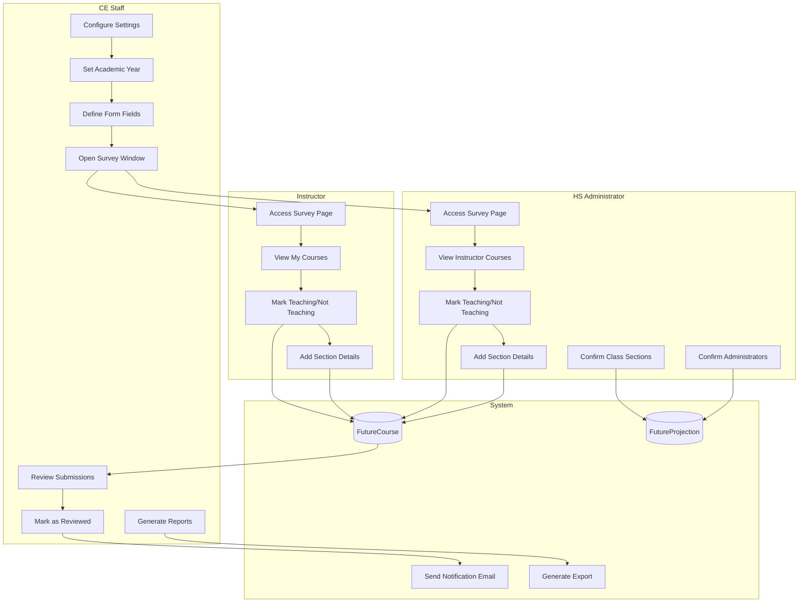
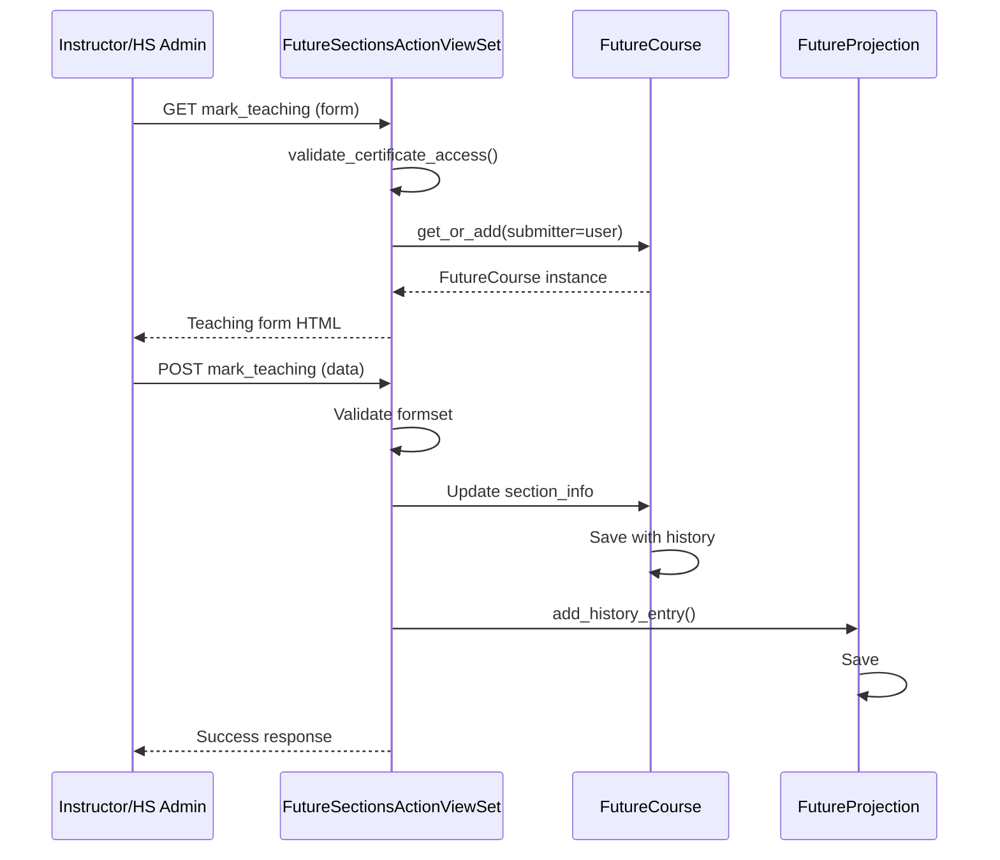
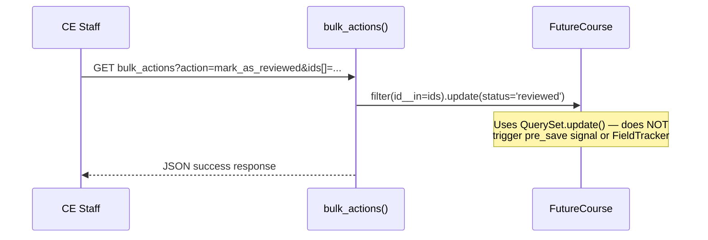
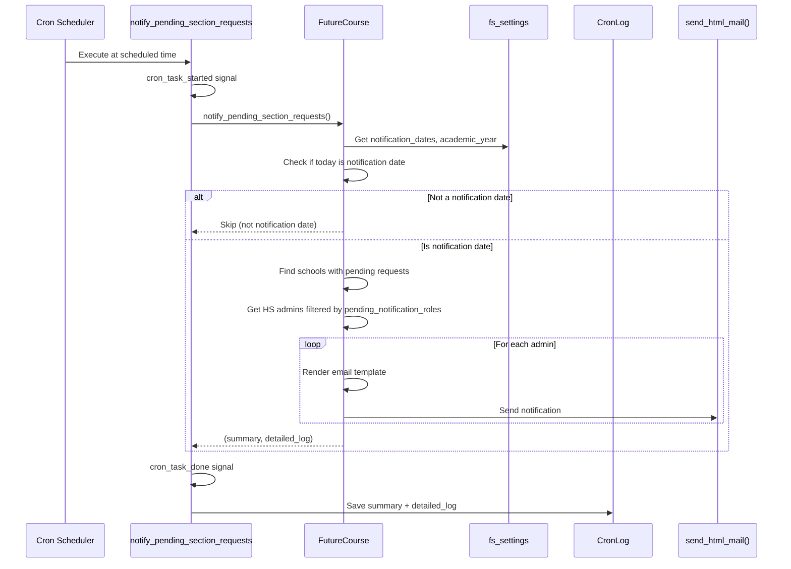
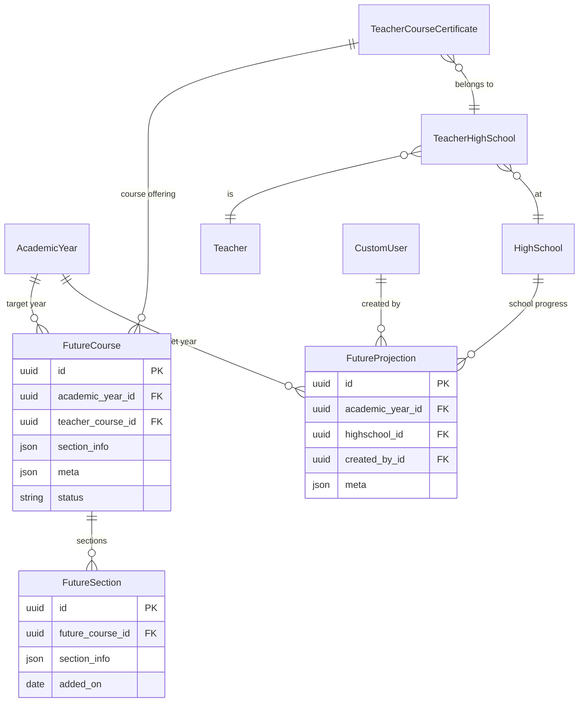
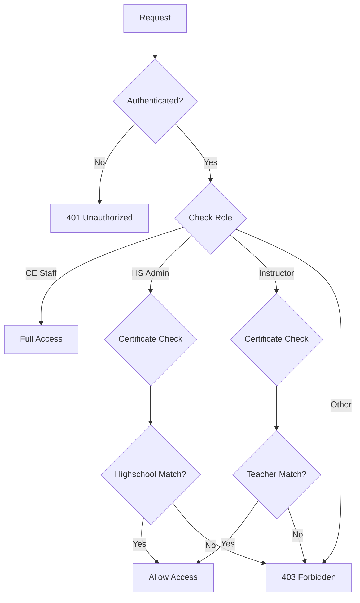

# Future Sections App - Architecture Documentation

## Overview

The `future_sections` app manages instructor section projections for upcoming academic years. It allows high schools to forecast course offerings by collecting information from instructors about which courses they plan to teach.

## Core Concepts

### Workflow

1. **Configuration Phase**: CE staff configures the survey window, academic year, and form fields via Settings
2. **Collection Phase**: HS Admins or Instructors submit section requests during the open window
3. **Review Phase**: CE staff reviews submissions and marks them as "reviewed"
4. **Export Phase**: Reports generate exports of submitted and pending requests

### User Roles

| Role | Description | Capabilities |
|------|-------------|--------------|
| CE Staff | Concurrent Enrollment administrators | Full access: view all, bulk actions, settings, reports |
| HS Admin | High School Administrator | Submit/edit for their schools, confirm administrators |
| Instructor | Teacher/Faculty | Submit/edit their own courses only |

---

## Workflow Diagrams

### Main Workflow (Swimlane)



### Submission Flow



### Review Flow



> **Note:** The `mark_as_reviewed` bulk action uses `QuerySet.update()`, which bypasses Django's `pre_save` signal. This means the `future_course_status_changed` signal handler (which sends review notification emails) is **not triggered** by the bulk review action. The signal only fires when individual `FutureCourse` instances are saved via `.save()`.

### Pending Request Notification Flow



### Data Model Relationships



### Permission Flow



---

## Models

### Location: `future_sections/models.py`

### FutureProjection

Tracks a high school's overall progress in the survey.

```
FutureProjection
├── id (UUID, PK)
├── academic_year (FK → AcademicYear)
├── highschool (FK → HighSchool)
├── created_by (FK → CustomUser)
├── meta (JSONField)
│   ├── confirmed_administrators: 'Yes'/'No'
│   ├── confirmed_class_sections: 'Yes'/'No'
│   ├── confirmed_choice_class_sections: 'Yes'/'No'
│   ├── confirmed_facilitator_class_sections: 'Yes'/'No'
│   └── history: [{user, action, on}]
└── started_on (DateField)

Unique: (academic_year, highschool)
```

### FutureCourse

Tracks an instructor's intention to teach a specific course.

```
FutureCourse
├── id (UUID, PK)
├── academic_year (FK → AcademicYear)
├── teacher_course (FK → TeacherCourseCertificate)
├── term (FK → Term, optional)
├── meta (JSONField)
│   ├── submitted_by: {id, email, name}  # Who submitted the request
│   ├── fp: str(FutureProjection.id)
│   └── history: [{user, action, on}]
├── section_info (JSONField)
│   ├── teaching: 'yes'/'no'
│   └── sections: [{term, term_name, estimated_enrollment, ...}]
├── status (CharField: 'submitted'/'reviewed')
├── started_on, last_viewed_on, submitted_on (DateFields)
└── tracker (FieldTracker: ['status'])  # For signal notifications

Unique: (teacher_course, academic_year)
```

**Key Methods:**
- `get_or_add(teacher_course, academic_year, section_info=None, submitter=None)` - Get or create
- `additional_fields()` - Returns field list from `teaching_form_config`
- `get_by_property(index, key)` - Get section property by index for exports
- `get_export_labels()` - Returns field labels for report headers
- `is_window_open()` - Check if submission window is active
- `create_teacher_application()` - Creates TeacherApplication from FutureCourse, fetches section files from S3
- `send_confirmation_email(mode)` - Sends confirmation email to instructor using settings templates
- `has_completed_all_courses()` - Checks if instructor responded to all eligible courses
- `as_string(mode)` - Returns future section info as formatted string (text or HTML)
- `welcome_message(highschools)` - Static method rendering welcome message template with shortcodes
- `notify_pending_section_requests()` - Sends reminder emails to HS admins with pending requests
- `get_setting_value(key)` - Static method retrieving values from Setting model
- `get_active_academic_year()` - Static method returning configured academic year ID
- `get_active_term()` - Static method returning configured term ID
- `get_active_course_status()` - Static method returning course status filters
- `get_active_course_certificate_status()` - Static method returning teacher course status filters
- `teaching_or_not` (property) - Returns 'Yes'/'No'
- `section_display` (property) - Formatted display from template

### FutureSection

Section-level details for each instructor. While `FutureCourse.section_info` JSONField now stores the primary section data, the FutureSection model remains actively used in the codebase (CE portal deletion, reports, queries).

```
FutureSection
├── id (UUID, PK)
├── future_course (FK → FutureCourse)
├── section_info (JSONField)
└── added_on (DateField)
```

**Key Methods:**
- `export_instructor_survey_export()` - Static method exporting instructor survey links to CSV
- `export_to_excel(records)` - Static method writing records to CSV
- `teaching_or_not` (property) - Returns 'Yes'/'No'
- `number_of_sections` (property) - Returns section count from section_info
- `estimated_enrollment` (property) - Returns enrollment estimate from section_info

---

## Views Architecture

### Location: `future_sections/views/`

### Unified API ViewSets (`api.py`)

Role-aware ViewSets that work for both HS Admin and Instructor portals.

```
FutureSectionsActionViewSet
├── mark_teaching (GET/POST)      # Mark course as teaching with section details
├── mark_not_teaching (GET/POST)  # Mark course as not teaching
├── remove_teaching_status        # Remove teaching status
├── add_teacher (GET/POST)        # Add new teacher (HS Admin only)
├── confirm_sections (POST)       # Confirm class sections
└── confirm_administrators (POST) # Confirm school administrators

CourseRequestViewSet
└── list()  # Returns certificates with merged FutureCourse status

AdminPositionViewSet
├── list()   # Returns highschool x role combinations
└── assign() # Assign administrator to position
```

### CE Portal Views (`ce.py`, `ce_api.py`)

Admin views for CE staff to manage all submissions.

```
Page Views (ce.py):
├── index()                         # Main listing page with DataTables
├── detail(record_id)               # Record detail (stub)
├── settings()                      # Settings page
├── delete_section()                # Delete a FutureSection record
├── bulk_actions()                  # Dispatcher for bulk operations
│   ├── mark_as_reviewed()          # Mark selected as reviewed
│   └── mark_as_submitted()         # Reset to submitted
├── future_sections_actions()       # AJAX dispatcher for teaching actions
│   ├── mark_as_teaching()          # CE-specific: mark course as teaching
│   ├── mark_as_not_teaching()      # CE-specific: mark course as not teaching
│   └── remove_marked_as_not_teaching() # CE-specific: remove teaching status
├── send_survey_to_instructors()    # Email survey links to instructors
├── get_highschool_admins()         # Return admins for a highschool (JSON)
└── send_pending_reminder()         # Send ad-hoc reminder to selected HS admins

API ViewSets (ce_api.py):
├── FutureClassSectionViewSet        # All FutureCourse records with filtering
├── FutureProjectionViewSet          # FutureProjection records by school
├── PendingFutureClassSectionViewSet # Certificates without responses
└── NotificationLogViewSet           # CronLog entries for notification history
```

### Page Views (`pages.py`)

Class-based view for rendering the main future sections page.

```python
FutureSectionsPageView(View)
├── get()  # Renders template with context
└── Uses get_user_context() for role-aware data
```

---

## URL Structure

### App Namespaces

Each portal registers its own Django app namespace for URL resolution:

| Namespace | Portal | Auth Check |
|-----------|--------|------------|
| `future_sections` | Generic/shared | None (base config) |
| `future_sections_highschool_admin` | HS Admin portal | `user_has_highschool_admin_role` |
| `future_sections_instructor` | Instructor portal | `user_has_instructor_role` |
| `future_sections_ce` | CE Admin portal | `user_has_cis_role` |

### Main URLs (`urls/__init__.py`)

Namespace: `future_sections`

```
/future_sections/
├── api/
│   ├── actions/           # FutureSectionsActionViewSet
│   ├── course-requests/   # CourseRequestViewSet
│   └── admin-positions/   # AdminPositionViewSet
└── (index)                # FutureSectionsPageView
```

### CE Portal URLs (`urls/ce.py`)

Namespace: `future_sections_ce`

```
/ce/future_sections/
├── api/
│   ├── future_class_section/           # FutureClassSectionViewSet
│   ├── future_projection/              # FutureProjectionViewSet
│   ├── pending_future_class_sections/  # PendingFutureClassSectionViewSet
│   └── notification_logs/             # NotificationLogViewSet
├── (index)                   # CE index page
├── ajax/                     # AJAX dispatcher (teaching actions)
├── <uuid:record_id>/         # Record detail
├── settings/                 # Settings page
├── delete/                   # Delete FutureSection record
├── bulk_actions/             # Bulk operations (reviewed/submitted)
├── get_highschool_admins/    # Return admins for a highschool
└── send_pending_reminder/    # Send ad-hoc reminder to HS admins
```

### HS Admin & Instructor Portal URLs

Namespaces: `future_sections_highschool_admin`, `future_sections_instructor`

Both portals share identical URL structure, differing only in auth guard:

```
/<portal>/future_sections/
├── api/
│   ├── actions/           # FutureSectionsActionViewSet
│   ├── course-requests/   # CourseRequestViewSet
│   └── admin-positions/   # AdminPositionViewSet
└── (index)                # FutureSectionsPageView (name: section_requests)
```

---

## Settings Configuration

### Location: `future_sections/settings/future_sections.py`

Key: `cis_future_sections` in the Setting model.

### Configuration Fields

#### Survey Window & Academic Year

| Field | Type | Purpose |
|-------|------|---------|
| `starting_date` | DateField | Window open date |
| `ending_date` | DateField | Window close date |
| `academic_year` | FK | Target academic year |
| `previous_academic_year` | FK | For comparison display |

#### UI & Page Configuration

| Field | Type | Purpose |
|-------|------|---------|
| `page_name` | Text | Breadcrumb/title display (default: "Future Section Requests") |
| `tab_title_course_requests` | Text | Label for Course Requests tab |
| `tab_title_school_personnel` | Text | Label for School Personnel tab |
| `course_display_template` | Text | Course column format (placeholders: `{course_name}`, `{course_title}`, `{credit_hours}`) |
| `welcome_message` | HTML | Displayed on main form (shortcodes: `{{academic_year}}`, `{{previous_academic_year}}`, `{{start_date}}`, `{{end_date}}`, `{{previous_year_classes}}`) |
| `welcome_message_personnel` | HTML | Displayed on personnel review tab |
| `window_closed_message` | HTML | Shown when survey window is closed |
| `teaching_message` | HTML | Instructions on section detail form |
| `new_teacher_message` | HTML | Instructions on add-teacher form |
| `edit_role_message` | HTML | Instructions on admin role edit form |

#### Course & Instructor Filters

| Field | Type | Purpose |
|-------|------|---------|
| `course_status` | MultiSelect | Which courses to include |
| `teacher_course_status` | MultiSelect | Which teacher statuses to include |

#### School Personnel

| Field | Type | Purpose |
|-------|------|---------|
| `school_admin_roles` | MultiSelect | Roles to verify |
| `allow_new_teacher_create` | Yes/No | Allow HS Admin to add teachers |
| `new_teacher_create_label` | Text | Label above "Add New Teacher" button |
| `create_new_instructor_app_for` | Select | Status for teacher applications created from new teachers |
| `confirm_checkbox_language` | HTML | Text for confirming staff/course additions |
| `confirm_administrators_language` | HTML | Text for confirming review completion |
| `confirm_administrators_header` | Text | Text displayed before confirmation boxes |

#### Form Configuration

| Field | Type | Purpose |
|-------|------|---------|
| `teaching_form_config` | JSON | Dynamic form configuration (see below) |
| `add_teacher_form_config` | JSON | Labels and help text for add-teacher form |

#### Reviewed Status Email

| Field | Type | Purpose |
|-------|------|---------|
| `send_reviewed_notification` | Yes/No | Enable review notifications |
| `reviewed_email_subject` | Text | Notification email subject |
| `reviewed_email_message` | HTML | Notification email template |

#### Pending Request Notifications

| Field | Type | Purpose |
|-------|------|---------|
| `pending_notification_dates` | Multi-Date | Dates to send pending reminders |
| `pending_notification_cron` | Cron | Time of day to send reminders |
| `pending_notification_roles` | MultiSelect | HS admin roles to receive pending reminders |
| `pending_notification_subject` | Text | Reminder email subject |
| `pending_notification_message` | HTML | Reminder email template |

#### Post-Submission Confirmation Email

| Field | Type | Purpose |
|-------|------|---------|
| `confirmation_email_subject` | Text | Subject (shortcodes: `{{academic_year}}`) |
| `confirmation_email_message` | HTML | Body (shortcodes: `{{future_sections}}`, `{{academic_year}}`, `{{admin_first_name}}`, `{{admin_last_name}}`, `{{highschool}}`) |

### teaching_form_config JSON Structure

```json
{
    "fields": ["term", "estimated_enrollment", "class_period"],
    "required": ["term"],
    "show_syllabus": true,
    "labels": {
        "estimated_enrollment": "Expected Number of Students",
        "class_period": "Period/Hour"
    },
    "help_texts": {
        "class_period": "e.g., 1st period, 2nd hour"
    },
    "display_template": "{term_name} | {syllabus_link} | Enrollment: {estimated_enrollment}"
}
```

**Available Fields:** term, estimated_enrollment, class_period, instruction_mode, highschool_course_name, number_of_sections, full_year, trimester, fall_only, spring_only, notes, teacher_changed

---

## Signals

### Location: `future_sections/signals.py`

### future_course_status_changed

Triggers when FutureCourse status changes to 'reviewed'.

**Behavior:**
1. Uses FieldTracker to detect status change
2. Checks `send_reviewed_notification` setting
3. Builds recipient list (teacher + submitter, deduplicated)
4. Renders email with shortcodes: `{{course}}`, `{{highschool}}`, `{{instructor_first_name}}`, `{{instructor_last_name}}`
5. Sends via `send_html_mail()` using `cis/email.html` template
6. DEBUG mode redirects to test email

---

## Management Commands

### Location: `future_sections/management/commands/`

### migrate_future_sections_data

Migrates future sections data from old `cis` app tables to the new `future_sections` app tables.

**Usage:**
```bash
# Dry run (default) — shows what would be migrated
python manage.py migrate_future_sections_data

# Execute the migration
python manage.py migrate_future_sections_data --execute

# Clear destination tables before migration
python manage.py migrate_future_sections_data --execute --clear

# Verify counts after migration
python manage.py migrate_future_sections_data --execute --verify
```

**Behavior:**
1. Checks source tables exist: `cis_futureprojection`, `cis_futurecourse`, `cis_futuresection`
2. Checks destination tables exist: `future_sections_futureprojection`, `future_sections_futurecourse`, `future_sections_futuresection`
3. Optionally clears destination tables (`--clear`)
4. Migrates tables in order: FutureProjection, FutureCourse, FutureSection
5. Uses `ON CONFLICT DO NOTHING` to handle duplicates
6. Optionally verifies counts match (`--verify`)

### notify_pending_section_requests

Sends reminder emails to HS administrators for schools that have not responded to section requests.

**Usage:**
```bash
# Manual run (checks if today is a notification date)
python manage.py notify_pending_section_requests

# Scheduled run with time parameter (for cron logging)
python manage.py notify_pending_section_requests -t "2024-01-15 08:00:00"
```

**Behavior:**
1. Checks if today is in `pending_notification_dates` setting
2. If not a notification date, skips with log entry
3. Finds schools with pending (unanswered) section requests
4. Gets HS administrators for those schools based on `pending_notification_roles`
5. Sends templated email to each administrator
6. Logs summary and detailed_log to CronLog model

**CronTab Integration:**
- When settings are saved, creates/updates CronTab entry with command `notify_pending_section_requests`
- Cron expression from `pending_notification_cron` field (e.g., `0 8 * * *` for 8 AM daily)
- Sends `cron_task_started` and `cron_task_done` signals for logging

**Shortcodes for pending_notification_message:**

| Shortcode | Description |
|-----------|-------------|
| `{{admin_first_name}}` | Administrator's first name |
| `{{admin_last_name}}` | Administrator's last name |
| `{{highschool}}` | High school name |
| `{{academic_year}}` | Target academic year name |
| `{{pending_count}}` | Number of pending course requests |
| `{{link}}` | URL to the section requests page |

**Model Method:**

`FutureCourse.notify_pending_section_requests()` returns `(summary, detailed_log)`:

```python
summary = "Sent 15 email(s), 0 error(s)"
detailed_log = {
    'emails_sent': [
        {'email': 'admin@school.edu', 'highschool': 'Example HS', 'pending_count': 5},
        ...
    ],
    'errors': [],
    'skipped': []
}
```

---

## Reports

### Location: `future_sections/reports/`

### future_classes

**Title:** Section Requests Export

Exports FutureCourse records with dynamic fields from `teaching_form_config`.

**Fields:**
- Base: ID, Added On, Academic Year, High School, CEEB, Teacher Name, Course, Offering Status
- Dynamic: Fields from `teaching_form_config.fields` with labels from `teaching_form_config.labels`

### pending_future_classes_courses

**Title:** Pending Section Requests - Course(s) Export

Exports TeacherCourseCertificate records that have NOT submitted responses.

**Fields:** ID, School, Teacher Name, Course, Status

### pending_future_classes

**Title:** Pending Section Requests - High School Admin Export

Exports HSAdministratorPosition records for schools with pending requests.

**Fields:** High School info, Administrator info, Position, Status

---

## Forms

### Location: `future_sections/forms.py`

| Form | Purpose |
|------|---------|
| `ConfirmHighSchoolAdministratorsForm` | Confirm school personnel; validates all required admin roles are assigned |
| `ConfirmClassSectionsForm` | Confirm class sections; validates all courses have FutureCourse entries |
| `TeacherCourseSectionForm` | Section details (term, enrollment, etc.); dynamic fields from `teaching_form_config` |
| `TeacherCourseTeachingForm` | Hidden fields (certificate ID, academic year) for teaching form submission |
| `TeacherCourseNotTeachingForm` | Not-teaching form with reason selection (another instructor, not taught, not sure) |
| `TeacherCourseBaseLinkFormSet` | BaseFormSet with validation requiring at least one section entry with a term |
| `AddNewTeacherForm` | Add new teacher to highschool; inherits from TeacherCourseSectionForm |
| `HSAdministratorPositionForm` | Assign administrator to position; supports new admin creation |
| `SearchInstructorByCohortForm` | Search instructors by cohort |
| `CourseTitleChoiceField` | Custom ModelChoiceField displaying course title only |

### Dynamic Form Configuration

Forms read `teaching_form_config` to dynamically show/hide fields:
```python
visible_fields = form_config.get('fields', ['term', 'estimated_enrollment'])
required_fields = form_config.get('required', ['term'])
custom_labels = form_config.get('labels', {})
```

---

## Permissions

### Location: `future_sections/permissions.py`

| Class | Access |
|-------|--------|
| `IsHSAdminOrInstructor` | HS Admin OR Instructor |
| `IsHSAdminOnly` | HS Admin only |
| `IsInstructorOnly` | Instructor only |
| `CanAccessCourseRequest` | Object-level: checks certificate ownership |

---

## Utilities

### Location: `future_sections/utils.py`

| Function | Purpose |
|----------|---------|
| `get_fs_config()` | Load settings from database |
| `get_user_context(request)` | Get user's role, highschools, teacher |
| `validate_certificate_access(request, teacher_course)` | Verify user can access certificate |
| `get_or_create_future_projection(highschool_id, user)` | Get/create FutureProjection |
| `add_history_entry(obj, user, action)` | Add to meta.history |
| `get_user_highschools(request)` | Get accessible highschools |
| `get_course_certificates_for_user(request)` | Get accessible certificates |

---

## Templates

### Location: `future_sections/templates/future_sections/`

| Template | Purpose |
|----------|---------|
| `future_sections.html` | Main survey page |
| `teaching_course.html` | Teaching details modal |
| `add_new_teacher.html` | Add teacher modal |
| `ce/index.html` | CE portal main page |
| `ce/settings.html` | CE portal settings |

---

## Data Flow Diagrams

### Submission Flow

```
Instructor/HS Admin
        │
        ▼
┌───────────────────┐
│  FutureSections   │ ──► Check is_window_open()
│    Page View      │
└───────────────────┘
        │
        ▼
┌───────────────────┐
│  mark_teaching()  │ ──► Validate certificate access
│   API Action      │
└───────────────────┘
        │
        ▼
┌───────────────────┐
│ FutureCourse.     │ ──► Store submitter in meta
│  get_or_add()     │
└───────────────────┘
        │
        ▼
┌───────────────────┐
│ Save section_info │ ──► {teaching: 'yes', sections: [...]}
└───────────────────┘
        │
        ▼
┌───────────────────┐
│ FutureProjection  │ ──► Track school's progress
│    history        │
└───────────────────┘
```

### Review Flow

```
CE Staff
    │
    ▼
┌───────────────────┐
│  CE Index Page    │ ──► DataTable with checkboxes
└───────────────────┘
    │
    ▼
┌───────────────────┐
│  bulk_actions()   │ ──► mark_as_reviewed / mark_as_submitted
│    Endpoint       │
└───────────────────┘
    │
    ▼
┌───────────────────┐
│ QuerySet.update() │ ──► Sets status directly in DB
│                   │     (pre_save signal NOT triggered)
└───────────────────┘
    │
    ▼
┌───────────────────┐
│  JSON response    │ ──► Count of records updated
└───────────────────┘
```

---

## Integration Points

### With CIS App

- Uses models: `Teacher`, `TeacherCourseCertificate`, `TeacherHighSchool`, `HSAdministrator`, `HSAdministratorPosition`, `HighSchool`, `AcademicYear`, `Term`, `Course`
- Uses utils: `user_has_highschool_admin_role()`, `user_has_instructor_role()`, `export_to_excel()`, `get_field()`
- Uses storage: `PrivateMediaStorage`
- Uses templates: `cis/email.html`

### With Report App

Reports registered in `apps.py` are discovered by the report app and made available in the CE Reports interface.

### With Setting App

Settings form registered in `CONFIGURATORS` appears in Settings admin interface.
