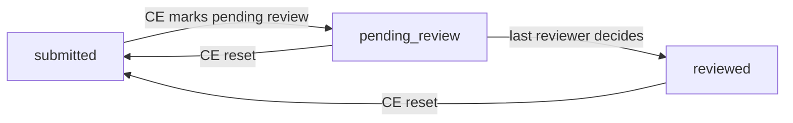
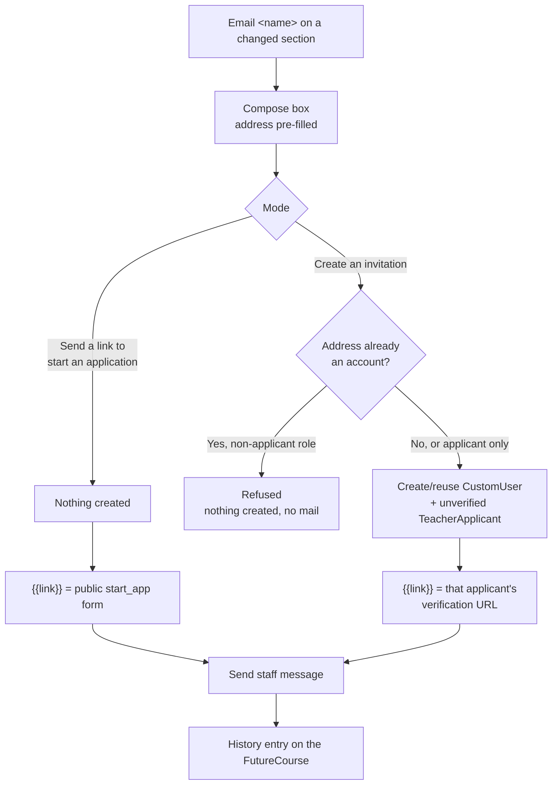

# Future Sections App

The `future_sections` app manages future course section requests for high school administrators and instructors. It provides a unified interface for both user roles with role-aware permissions.

## Installation

### 1. Add to INSTALLED_APPS

In your `settings.py`, add `future_sections` to `INSTALLED_APPS`:

```python
INSTALLED_APPS = [
    # ... other apps
    'future_sections',
]
```

### 2. Add Static Files

Add the future_sections staticfiles directory to `STATICFILES_DIRS` in `settings.py`:

```python
STATICFILES_DIRS = [
    # ... other dirs
    os.path.join(BASE_DIR, 'future_sections', 'staticfiles'),
]
```

### 2.1 Update views/term.py

from rest_framework.authentication import TokenAuthentication, SessionAuthentication

class TermViewSet(viewsets.ReadOnlyModelViewSet):
    serializer_class = TermSerializer
    authentication_classes = [TokenAuthentication, SessionAuthentication]
    
    permission_classes = [CIS_user_only]

    def get_queryset(self):
        academic_year_id = self.request.GET.get('academic_year', None)
        result = Term.objects.all()

        if academic_year_id:
            result = result.filter(academic_year__id=academic_year_id)  

        return result.order_by('-code')

### 3. Run Migrations

```bash
python manage.py migrate future_sections
```

### 4. Register Settings and Reports

```bash
python manage.py register_settings
python manage.py register_reports
```

### 5. Include URLs

In your main `urls.py` (e.g., `myce/urls.py`), add the URL configurations:

```python
from django.urls import path, include

urlpatterns = [
    # ... other URLs

    # Portal-specific URLs
    path('highschool_admin/future_sections/', include('future_sections.urls.highschool_admin')),
    path('instructor/future_sections/', include('future_sections.urls.instructor')),
    path('ce/future_sections/', include('future_sections.urls.ce')),

    # Shared API URLs
    path('future_sections/', include('future_sections.urls')),
]
```

### 5a. Register Menu Entries

Sidebar menus are configured per role via the `cis.settings.menu.menu` Setting form (see **CE Portal → Settings → Portal Menus** in the running app). Each role has a JSON textarea (`ce_menu`, `faculty_menu`, `instructor_menu`, `highschool_admin_menu`, …) whose value is a JSON array of nav-item objects. The form lives at `cis/settings/menu.py` in code.

Edit each role's JSON textarea and merge the snippets below into the existing array. Labels and icons can be customized.

**CE Admin (`ce_menu`)** — add the highlighted entries inside the existing `"name":"classes"` sub_menu:

```json
{
   "type":"nav-item",
   "icon":"fas fa-fw fa-align-left",
   "label":"Classes",
   "name":"classes",
   "sub_menu":[
      {
         "label":"Course Projections",
         "name":"future_sections",
         "url":"future_sections_ce:future_sections"
      },
      {
         "label":"Review Section Requests",
         "name":"section_requests",
         "url":"future_sections_ce:section_request_list"
      }
   ]
}
```

**Faculty (`faculty_menu`)** — add as a top-level nav item:

```json
{
   "type":"nav-item",
   "icon":"fas fa-fw fa-clipboard-list",
   "name":"section_requests",
   "label":"Section Requests",
   "url":"future_sections_faculty:section_request_list"
}
```

**High School Admin (`highschool_admin_menu`)** — add as a top-level nav item:

```json
{
   "type":"nav-item",
   "icon":"fas fa-fw fa-calendar-alt",
   "name":"section_requests",
   "label":"Course Projections",
   "url":"future_sections_highschool_admin:section_requests"
}
```

**Instructor (`instructor_menu`)** — add as a top-level nav item:

```json
{
   "type":"nav-item",
   "icon":"fas fa-fw fa-calendar-alt",
   "name":"section_requests",
   "label":"Section Requests",
   "url":"future_sections_instructor:section_requests"
}
```

After saving the Setting, the new entries appear in the sidebar on the next page load. The Faculty and CE "Review Section Requests" entries are gated by the **Do course proposals need to be reviewed?** + **Reviewer Roles** settings (see [Settings Reference → Section Request Review](#section-request-review)); when review is disabled, the URLs return 404 even though the menu items are visible.

### 5b. Add Reviewer Role to `CourseAdministrator`

The Section Request Review flow (see [Settings Reference → Section Request Review](#section-request-review)) keys off the `role` field on `cis.CourseAdministrator`. The built-in choices are `Administrator`, `Faculty`, `Visitor`, `Dept. Chair`, `Dean`, and `FC Reviewer`.

If your tenant uses a different role label for reviewers (e.g. "Program Coordinator", "Subject Lead"), add it to `ROLE_OPTIONS` in `cis/models/course.py` so it's selectable both on the `CourseAdministrator` admin page and in the **Reviewer Roles** / **Mentor CourseAdministrator Role** dropdowns on the settings form:

```python
# cis/models/course.py — class CourseAdministrator
ROLE_OPTIONS = [
    ('Administrator', 'Administrator'),
    ('Faculty', 'Faculty'),
    ('Visitor', 'Visitor'),
    ('Dept. Chair', 'Dept. Chair'),
    ('Dean', 'Dean'),
    ('FC Reviewer', 'FC Reviewer'),
    # Add your tenant-specific reviewer role here:
    # ('Program Coordinator', 'Program Coordinator'),
]
```

After editing, generate and run a migration:

```bash
python manage.py makemigrations cis
python manage.py migrate
```

### 5c. Run the cycle-terms migration (existing tenants only)

If you're upgrading from a release without per-term cycle support (i.e. you previously configured the cycle by **Requesting Information For** alone), run:

```bash
python manage.py migrate_cycle_terms
```

This populates `cycle_terms` from the existing `academic_year` setting (all `Term` rows under that AY). It's idempotent — safe to re-run. After running, set **Lookback Terms** manually in **CE Portal > Settings > Section Requests**; the migration intentionally leaves that field empty so the operator picks the historical terms that should drive the reminder universe.

### 6. Add Flatpickr to header-includes.html

```html
<!-- Flatpickr for multi-date selection -->
<link rel="stylesheet" href="https://cdn.jsdelivr.net/npm/flatpickr/dist/flatpickr.min.css">
<script src="https://cdn.jsdelivr.net/npm/flatpickr"></script>
```

### 7. Load Initial Data (Optional)

If you have existing FutureCourse data from a legacy system:

```bash
python manage.py migrate_future_sections_data
```

### 8. Configure Settings

Navigate to **CE Portal > Settings > Classes > Section Requests** to configure the app.

## Settings Reference

### General Settings

| Setting | Description |
|---------|-------------|
| **Page Name** | Name displayed in the breadcrumb and page title |
| **Course Requests Tab Title** | Label for the Course Requests tab |
| **School Personnel Tab Title** | Label for the School Personnel tab |
| **Requesting Information For** | The academic year you are collecting section requests for. Derived from **Cycle Terms** on save — kept in the settings JSON for backward compatibility with existing `FutureCourse.academic_year` FK queries. |
| **Previous Year Reference** | A prior academic year to show what was previously offered |
| **Previous Year Class Status** | Which `ClassSection` statuses count toward the **Previous Year** column and the copy-last-year prefill. Choices come from `ClassSection.CLASS_STATUS`, whose stored values are codes (`A`, `C`) rather than labels. Leave every option unselected to count classes of any status. |
| **Starting Date / Ending Date** | Survey window for submissions |
| **Course Column Display Template** | Template for the Course column. Placeholders: `{course_name}`, `{course_title}`, `{credit_hours}` |

### Cycle Scope & Lookback

Drives which terms a cycle covers and which teachers are expected to respond. Cycles are still **singleton** — one active cycle at a time per tenant — but a cycle can now span one or more terms within a single Academic Year.

| Setting | Description |
|---------|-------------|
| **Cycle Terms** | One or more `Term` rows the cycle is collecting forecasts for. All selected terms must share one Academic Year (validated in `clean()` and live-hinted in the settings JS). Schools running annually pick all terms in the AY; schools running per semester pick one term and re-open the cycle for the next. The **Requesting Information For** AY is derived from this selection on save. |
| **Lookback Terms** | One or more `Term` rows that define **who's expected to respond**. The universe is the set of `TeacherCourseCertificate` rows whose teacher × course had an Active (`status='A'`) `ClassSection` in any selected term. Used by both the submission-form universe (`utils.get_course_certificates_for_user`) and the reminder pending-detection query. |
| **Allow HS Administrators to create new teachers?** (existing) | When `Yes`, also includes `TeacherCourseCertificate` rows with `status='Applicant'` in the universe — applicants can be reminded even without prior Section history. When `No`, only teachers with a qualifying Section in the lookback terms are surfaced. |

**Copying last year's sections.** When an instructor opens a course with no saved response, the formset is pre-populated from that teacher's previous-year sections — one row per previous term, with the term mapped through **Term Mapping**. This only runs when Term Mapping is configured; with an empty mapping nothing is copied and the form opens with a single blank row. Which previous-year classes qualify is governed by **Previous Year Class Status**, the same setting that drives the Previous Year column, so the two can never disagree. Terms present in the mapping but left unmapped still produce a row, with the term dropdown empty for the instructor to fill in.

**Reminder behaviour.** `notify_pending_section_requests` anchors on the lookback universe (minus certs that already have a `FutureCourse` for the cycle's AY). The reminder email gains a new `{{missing_terms}}` shortcode listing the cycle terms each school hasn't yet responded for — computed per-school from `FutureCourse.section_info.sections[*].term` coverage. Schools whose submissions cover every cycle term render an empty `{{missing_terms}}`.

### Portal Messages

| Setting | Description |
|---------|-------------|
| **Welcome Message** | Displayed on the main page. Shortcodes: `{{academic_year}}`, `{{previous_academic_year}}`, `{{start_date}}`, `{{end_date}}`, `{{previous_year_classes}}` |
| **Welcome Message - School Personnel Review Tab** | Displayed on the personnel review tab |
| **Window Closed Message** | Displayed when the submission window is closed |
| **Message in 'Teaching' Page** | Displayed on the section info form |
| **Message in 'Add New Teacher' Page** | Displayed on the add teacher form |
| **Message in 'Edit Role' Page** | Displayed on the school admin edit form |

### School Personnel

| Setting | Description |
|---------|-------------|
| **Require School Personnel Confirmation?** | If Yes, HS admins must review and confirm school personnel. Toggles visibility of the fields below |
| **High School Roles to Verify** | Roles shown in the personnel verification step (hidden if confirmation not required) |
| **School Personnel Confirmation Checkbox Text** | Checkbox text for confirming personnel review (hidden if confirmation not required) |
| **Require All Roles Confirmed Before Submission** | If Yes, all selected roles must have an active administrator before the HS admin can submit (hidden if confirmation not required) |
| **Require All Teachers Confirmed Before Submission** | If Yes, all teachers must have course information indicated before submission |
| **Course Offerings Confirmation Checkbox Text** | Checkbox text for confirming course offerings review |
| **Confirmation Section Header** | Header text above the "Confirm & Continue" checkboxes on both tabs |

### Course & Instructor Configuration

| Setting | Description |
|---------|-------------|
| **Eligible Course Status** | Only courses with selected status(es) are available for section requests |
| **Eligible Instructor Course Status** | Only instructor-course assignments with selected status(es) appear in requests |
| **Allow HS Administrators to create new teachers?** | If Yes, shows the fields below |
| **'Add New Teacher' Prompt** | Text displayed above the add teacher button (hidden if not allowed) |
| **Create New Instructor App For** | Which instructor course statuses trigger a new instructor application (hidden if not allowed). Gated on the **certificate's** status, not on anything being new — it fires both from the add-teacher route and from any ordinary "Enter Course Details" save. |
| **Default Status of Instructor Apps** | Default status assigned to new instructor applications created during section requests (hidden if not allowed) |
| **'Enter Course Details' Button Label** | Wording of the button used to record planned sections. Plain text — markup is stripped on save. Leave blank for the default. |
| **'Not Teaching' Button Label** | Wording of the button used to indicate a course will not be offered. Plain text. Leave blank for the default. |

Both button labels apply to the HS admin/instructor portal and the CE portal, which render the same two buttons from separate markup.

### Section Request Review

Drives the post-submission review flow under `/faculty/future_sections/section_requests/` and `/ce/future_sections/section_requests/`.

Review is a **quorum**, not a single decision. When CE marks a batch pending review,
`open_review_round()` snapshots every currently-qualifying reviewer (an Active
`CourseAdministrator` row in one of the **Reviewer Roles**, on the request's course) as a
`SectionRequestReview` row for that round and moves the request to `pending_review`. Each
snapshotted reviewer files their own decision; once every row in the live round has one, the
request advances to `reviewed` automatically. **`reviewed` carries no aggregate verdict** —
it only means everyone has weighed in, and CE reads the individual decisions to act on it.
CE can reset a `pending_review` or `reviewed` request back to `submitted`, which unlocks it;
the finished round's rows are left in place as history, and the next `open_review_round()`
call starts round `N+1`.



While a request is `pending_review` or `reviewed` (`FutureCourse.LOCKED_STATUSES`), the high
school administrator and instructor can no longer edit it — the teaching formset save, the
add-teacher form, and the mark-teaching/not-teaching API actions all refuse the write, and
the school-facing table hides the edit controls on a locked row. CE is never locked out of
its own controls.

| Setting | Description |
|---------|-------------|
| **Do course proposals need to be reviewed?** | If Yes, designated `CourseAdministrator` rows on the course can review submitted requests. If No, the review list and detail URLs return 404 and the faculty/CE menu entries are inert, and the request never reaches `pending_review`. |
| **Reviewer Roles** | Which `CourseAdministrator.role` values are allowed to review (hidden when review is disabled). Read at the moment CE opens a round: those are the users snapshotted onto it. A user sees a request iff they hold a `SectionRequestReview` row on it — snapshot membership, not their current `CourseAdministrator` status, so deactivating a reviewer mid-round does not strand the request and adding one does not pull them into a round already running. To add a role to this dropdown, edit `CourseAdministrator.ROLE_OPTIONS` in `cis/models/course.py` (see [Installation Step 5b](#5b-add-reviewer-role-to-courseadministrator)). |
| **Assign a mentor during review?** | Only visible when review is required. If Yes, approving a request requires picking or creating a mentor; the mentor is stored as a foreign key on the reviewer's `SectionRequestReview` row and added as a `CourseAdministrator` row on the course. If No, approvals submit with just decision + comment (hidden mentor row in the review form). |
| **Mentor CourseAdministrator Role** | Which role the mentor's `CourseAdministrator` row gets on the course (defaults to `Faculty`). Hidden when review is disabled OR mentor assignment is disabled. The mentor user is always added to the `faculty` group with a `FacultyCoordinator` record, regardless of this role. |

The CE index shows quorum progress ("2 of 3 decided") on a three-way status badge; clicking
it opens a **Reviewers modal** listing each snapshot reviewer, their qualifying role,
decision (or Awaiting), decision date, comment, and — for anyone still undecided — a
**Send reminder** action. See [Pending Review Notifications](#pending-review-notifications)
for the scheduled version of that reminder.

> **Storage:** review decisions live in `SectionRequestReview` rows (one per reviewer per
> round), not in JSON. Older records created before this quorum model shipped had their
> single decision stored at `FutureCourse.section_info['faculty_review']`; migration `0006`
> converts that JSON (including its `history` list) into `SectionRequestReview` rows once,
> and leaves the original JSON in place as a backstop.

### Pending Review Notifications

Scheduled reminders to reviewers who still have an outstanding decision in the live round.
Recipients are derived from the round's `SectionRequestReview` snapshot, not configured —
there is no roles field here, unlike Pending Request Notifications below.

| Setting | Description |
|---------|-------------|
| **Pending Review Notification Dates** | Specific dates to send reminder notifications to reviewers with an undecided slot. |
| **Notification Time (Cron Expression)** | Cron schedule for `notify_pending_reviews` (`Min Hr Day Month WeekDay`). |
| **Pending Review Notification Subject** | Subject line for the reviewer reminder email. |
| **Pending Review Notification Message** | Email template listing everything one reviewer owes. Shortcodes: `{{reviewer_first_name}}`, `{{reviewer_last_name}}`, `{{pending_count}}`, `{{requests}}`, `{{link}}`. |

One email is sent per reviewer per run, listing every request they have not yet decided on.
A **Review Notification History** tab on the CE index shows the send log, alongside the
per-reviewer on-demand **Send reminder** action in the Reviewers modal.

### New Teacher Outreach

When an instructor marks a section as having a new teacher (**Did the teacher change?** = Yes), CE staff get an **Email &lt;name&gt;** action on that section in the CE Course Requests table. It opens a compose box with the captured address pre-filled and the message below as a starting point, editable before sending.

| Setting | Description |
|---------|-------------|
| **New Teacher Email Subject** | Subject pre-filled in the compose box. Leave blank for the default. |
| **New Teacher Email Message** | Body pre-filled in the compose box. Shortcodes: `{{new_teacher_name}}`, `{{course}}`, `{{highschool}}`, `{{academic_year}}`, `{{current_teacher_name}}`, `{{term_name}}`, `{{link}}`. Leave blank for the default. |

Staff pick one of two modes per email. `{{link}}` resolves differently in each, and only one of them creates anything:



Notes on the invite path:

- **It never emails a `complete_signup` link.** That view is public, does not check `account_verified`, and on POST sets a password and logs the user in. The verification URL is sent instead, so the recipient proves they control the address first.
- **No `TeacherApplication` is created.** The self-serve signup flow creates that record once the teacher completes their profile; creating one here would leave a half-populated duplicate.
- **An existing account with any non-applicant role is refused** rather than reused, so a mistyped address belonging to a student or administrator cannot have an applicant record attached to it.
- Staff must tick a confirmation box before sending, because the address was typed by a high school administrator.
- Sends are recorded in `FutureCourse.meta['history']`, which the CE table already renders. The **Notification History** tab is the scheduled reminder job's run log and does not include these.

### Form Configuration

| Setting | Description |
|---------|-------------|
| **Teaching Form Configuration** | Visual UI for configuring which fields appear on the teaching form, their labels, required status, and display order |
| **Add Teacher Form Configuration** | Visual UI for configuring the add teacher form fields |

Rows in both tables are ordered by **dragging them by the grip handle**; the weight column renumbers itself and is read-only. Ordering is stored in the existing `weights` map, so saved configurations are unaffected. Drag behaviour comes from the shared `cis` asset `js/field_weights.js`, embedded as a `<script>` tag in the generated settings HTML — the settings page is injected with jQuery `.html()`, so a `Media`-declared file can lose the race and silently never bind.

#### Configurable section fields

`TeachingSectionFieldSchema` (`schemas.py`) is the single source of truth for the fields available on the teaching form. Adding a field there makes it appear in the settings table, the export headers, and the display-template placeholder list with no further wiring.

| Widget type | Renders as | Notes |
|-------------|-----------|-------|
| `text` / `textarea` | text input / textarea | |
| `checkbox` | boolean checkbox | |
| `select` | dropdown | Choices from schema metadata or a tenant setting |
| `date` | `<input type="date">` | Stored as an ISO `YYYY-MM-DD` string — `section_info` is a `JSONField` and `date` objects are not serializable |
| `email` | email input | Validated as an address |
| `file` | file upload | The stored value is the storage URL. A hidden `<name>_existing` companion carries the previous URL so saving without re-uploading does not lose the file |

Fields declaring `depends_on` render underneath their parent and are revealed when it is answered "yes" — `new_teacher_name` and `new_teacher_email` under **Did the teacher change?**, `new_highschool_title` under **Did the high school title change?**.

`start_date` and `end_date` are independent fields; when both are visible and filled, an end date earlier than the start date is rejected.

**File-field values are allowlisted on save.** A value only persists if this request uploaded it or it already appears under that key elsewhere on the same record, so a posted URL cannot be substituted for an arbitrary one.

### Reviewed Status Email

| Setting | Description |
|---------|-------------|
| **Send Email When Status Changes to Reviewed** | Enable/disable review notification emails. Toggles visibility of the fields below |
| **Reviewed Notification Email Subject** | Subject line for the review email |
| **Reviewed Notification Email Message** | Email template. Shortcodes: `{{course}}`, `{{highschool}}`, `{{instructor_first_name}}`, `{{instructor_last_name}}` |

### Pending Request Notifications

| Setting | Description |
|---------|-------------|
| **Pending Request Notification Dates** | Specific dates to send reminder notifications |
| **Notification Time (Cron Expression)** | Cron schedule for notification timing |
| **Pending Request Notification Roles** | Which HS admin roles receive reminders |
| **Pending Request Notification Subject** | Subject line for the reminder email |
| **Pending Request Notification Message** | Email template. Shortcodes: `{{admin_first_name}}`, `{{admin_last_name}}`, `{{highschool}}`, `{{academic_year}}`, `{{pending_count}}`, `{{link}}`, `{{start_date}}`, `{{end_date}}` |

### Confirmation Email

| Setting | Description |
|---------|-------------|
| **Confirmation Email Subject** | Subject line for post-submission email. Shortcodes: `{{academic_year}}` |
| **Confirmation Email Message** | Email template. Shortcodes: `{{future_sections}}`, `{{academic_year}}`, `{{admin_first_name}}`, `{{admin_last_name}}`, `{{highschool}}` |

## Dependencies

The app depends on these Django apps:
- `cis` - Core models (Course, Teacher, HighSchool, etc.)
- `instructor_app` - Teacher application models
- `setting` - Settings framework
- `report` - Reporting framework

Python packages:
- `django-crispy-forms` - Form rendering
- `djangorestframework` - API endpoints
- `model-utils` - FieldTracker for change detection

## Directory Structure

```
future_sections/
├── apps.py               # App config with CONFIGURATORS and REPORTS
├── forms.py              # Form classes
├── models.py             # FutureCourse, FutureSection, FutureProjection
├── serializers.py        # DRF serializers
├── permissions.py        # Permission classes
├── schemas.py            # TeachingSectionFieldSchema
├── signals.py            # Django signals (review notification)
├── utils.py              # Shared utilities
├── reports/
│   ├── future_classes.py                # Section Requests Export
│   ├── pending_future_classes.py        # Pending - HS Admin Export
│   └── pending_future_classes_courses.py # Pending - Courses Export
├── settings/
│   └── future_sections.py  # App settings form
├── staticfiles/
│   └── future_sections/
│       └── js/
│           ├── future_sections.js  # Frontend JavaScript
│           └── settings.js         # Settings page toggle logic
├── templates/
│   └── future_sections/
│       ├── future_sections.html    # Main page template (HS Admin/Instructor)
│       ├── teaching_course.html    # Teaching form modal
│       ├── add_new_teacher.html    # Add teacher form modal
│       └── ce/
│           ├── index.html              # CE portal main page
│           ├── email_new_teacher.html  # New-teacher outreach compose box
│           └── settings.html           # CE portal settings page
├── templatetags/
│   └── future_sections_tags.py     # Custom template tags
├── urls/
│   ├── __init__.py           # Main URL configuration
│   ├── highschool_admin.py   # HS Admin portal URLs
│   ├── instructor.py         # Instructor portal URLs
│   ├── ce.py                 # CE portal URLs (incl. review routes)
│   └── faculty.py            # Faculty portal review routes
├── review/
│   ├── __init__.py
│   ├── helpers.py            # Reviewer-role lookup, quorum snapshot/decision/lock, mentor create-or-attach
│   ├── forms.py              # SectionRequestReviewForm (mentor_role + require_mentor)
│   ├── api.py                # SectionRequestSerializer + portal-agnostic ViewSet
│   └── views.py              # section_request_list / _detail with portal shims
├── management/
│   └── commands/
│       ├── migrate_future_sections_data.py  # Data migration from cis app
│       ├── notify_pending_section_requests.py # Pending reminder emails (HS admins)
│       └── notify_pending_reviews.py       # Pending reminder emails (reviewers)
└── views/
    ├── __init__.py
    ├── api.py            # Action and data ViewSets
    ├── pages.py          # Unified page view (HS Admin/Instructor)
    ├── hs_admin.py       # HS Admin wrapper
    ├── instructor.py     # Instructor wrapper
    ├── ce.py             # CE portal views
    └── ce_api.py         # CE portal API ViewSets
```

## URL Structure

### Portal-Specific URLs

**High School Admin Portal** (`/highschool_admin/future_sections/`):
- Main page and API endpoints

**Instructor Portal** (`/instructor/future_sections/`):
- Main page and API endpoints

**CE Admin Portal** (`/ce/future_sections/`):
- Main page (Course Requests dashboard)
- Settings management
- AJAX dispatcher for teaching/not-teaching actions and new-teacher outreach. Requires the `ce` role — like every other route in this URLconf, it is wrapped in `user_passes_test(user_has_cis_role)`.
- Record detail, delete, bulk actions
- Admin lookup and ad-hoc reminder sending
- API endpoints for future class sections, projections, pending sections, notification logs
- Section request review (`section_requests/` + `section_requests/<uuid>/` + `section_request_api/`)

**Faculty Portal** (`/faculty/future_sections/`):
- Section request review for users with a qualifying `CourseAdministrator` row (`section_requests/` + `section_requests/<uuid>/` + `section_request_api/`)
- Gated by the **Do course proposals need to be reviewed?** and **Reviewer Roles** settings

### Shared API URLs (`/future_sections/`):
- `api/actions/mark-teaching/` - Mark course as teaching
- `api/actions/mark-not-teaching/` - Mark course as not teaching
- `api/actions/remove-teaching-status/` - Remove teaching status
- `api/actions/add-teacher/` - Add new teacher course
- `api/actions/confirm-sections/` - Confirm class sections
- `api/actions/confirm-administrators/` - Confirm administrators
- `api/course-requests/` - List course requests
- `api/admin-positions/` - List/manage admin positions

## Permissions

| Class | Access |
|-------|--------|
| `IsHSAdminOrInstructor` | HS Admin OR Instructor |
| `IsHSAdminOnly` | HS Admin only |
| `IsInstructorOnly` | Instructor only |
| `CanAccessCourseRequest` | Object-level: verifies user owns or manages the certificate |

## Signals

### Review Notification

When a `FutureCourse` is saved via `.save()` and the status changes to `'reviewed'`, an email is sent to the instructor and the original submitter. Controlled by `send_reviewed_notification` setting.

> **Note:** Bulk "Mark as Reviewed" uses `QuerySet.update()` which does **not** trigger this signal.

## Reports

| Report | Description |
|--------|-------------|
| **Section Requests Export** | Exports FutureCourse records with dynamic fields from `teaching_form_config` |
| **Pending - Course(s) Export** | Exports TeacherCourseCertificate records that haven't submitted requests |
| **Pending - HS Admin Export** | Exports HSAdministratorPosition records for schools with pending requests |

## Configuration

### Teaching Form Configuration

Configure via the visual UI in settings or as JSON in `teaching_form_config`:

```json
{
    "fields": ["term", "estimated_enrollment", "class_period"],
    "required": ["term"],
    "show_syllabus": true,
    "labels": {
        "estimated_enrollment": "Expected Number of Students"
    },
    "help_texts": {
        "class_period": "e.g., 1st period, 2nd hour"
    },
    "weights": {
        "estimated_enrollment": 1,
        "class_period": 2
    },
    "display_template": "{term_name} | {syllabus_link}"
}
```

### Add Teacher Form Configuration

Configure via the visual UI in settings or as JSON in `add_teacher_form_config`:

```json
{
    "fields": ["highschool", "course", "term", "teacher", "teacher_first_name"],
    "required": ["highschool", "course", "term", "teacher"],
    "labels": {
        "teacher": "Select Instructor"
    }
}
```

## Troubleshooting

### Settings JS not loading

Ensure `future_sections/staticfiles` is in `STATICFILES_DIRS` in your Django settings. Run `collectstatic` if in production.

### Reports not appearing

```bash
python manage.py register_reports
```

### Settings not appearing

```bash
python manage.py register_settings
```

### Email notifications not sending

1. Check that `send_reviewed_notification` is set to "Yes" in settings
2. Verify email configuration in Django settings
3. Check that the instructor has a valid email address
4. Bulk "Mark as Reviewed" bypasses `pre_save` signal — notifications only fire on `.save()`
5. `send_html_mail` **queues** through django-mailer rather than delivering inline, so nothing leaves until the queue is processed. In tests, flush with `mailer.engine.send_all()`.

### Previous Year column is blank for every school

`ClassSection.status` stores codes (`A`, `C`), not labels. Check **Previous Year Class Status** selects the codes your data actually uses — an empty selection counts every status, which is the safe default. Also confirm **Previous Year Reference** points at an academic year that has sections.

### Nothing is copied when opening a course

Copying requires **Term Mapping** to be configured; an empty mapping disables it entirely and the form opens with one blank row. Check also that the previous-year sections match the teacher, course, and school on the certificate, and that their status is selected in **Previous Year Class Status**.

### A new column or serializer field never reaches a CE table

`rest_framework_datatables` filters each row down to the fields named in the `columns[i][data]` params the browser sends. A serializer field with no matching `<th data-data="...">` is stripped in transit, and JS reading it silently sees `undefined`. Either add a column for it or nest it inside a field that is already requested — `changed_teacher_sections` rides inside `section_display` for exactly this reason. Note that querying the API by hand without `columns[i][data]` params returns the full payload and will not reproduce the problem.

### Settings page JS not binding

The settings form is rendered with `render_crispy_form` and injected via jQuery `.html()`, which fetches injected `<script src>` tags asynchronously. A file declared only in `Media` can therefore execute after the code that depends on it. Embed the `<script>` tag in the generated HTML instead, as the field-ordering and settings assets do.
